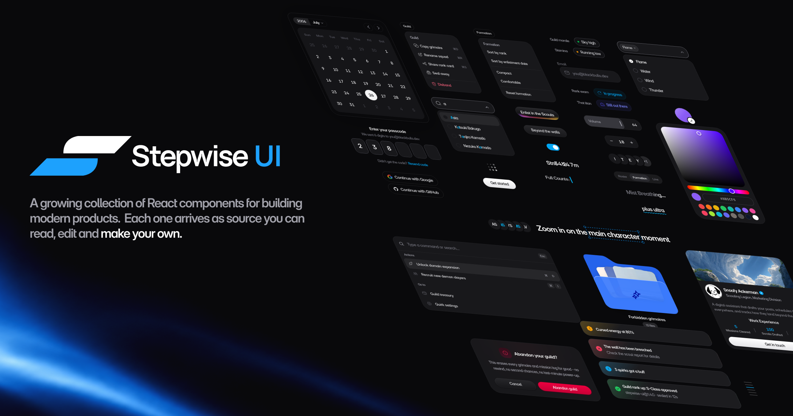

<div align="center">

<picture>
  <source media="(prefers-color-scheme: dark)" srcset="www/public/brand/logo-mark-dark.svg">
  
</picture>

# Stepwise UI

**A growing collection of React components for building modern products.**<br>
Each one arrives as source you can read, edit and make your own.

[](https://www.npmjs.com/package/stepwise-ui)
[](#license)
[](https://ui.stepwise.studio/docs/introduction)

[**Documentation**](https://ui.stepwise.studio) · [Quick Start](https://ui.stepwise.studio/docs/quick-start) · [CLI](https://ui.stepwise.studio/docs/cli) · [Agents](https://ui.stepwise.studio/docs/agents)



</div>

## Install

```bash
npx stepwise-ui init
```

An interactive picker: search the registry, choose what you want, and it writes
the source into your project. It offers to set up the two things components need
(the dark-mode variant and the `@/` path alias) and asks before touching either.

Know what you want already?

```bash
npx stepwise-ui add button input toast
```

Registry dependencies resolve automatically, and the npm packages a component
imports are installed for you.

## What makes it different

**The source lands in your repo.** There is no `<StepwiseProvider>`, no theme
object to fight, no `!important` to win a specificity argument with a package
you cannot see. The button is a file in `components/stepwise/button.tsx`. Open
it and change it.

**Every rounded surface is a squircle.** Corners use
[`@lisse/react`](https://github.com/JaceThings/Lisse) at `smoothing: 0.6`,
not `border-radius` - the same continuous curvature Apple uses, where the
straight edge and the arc meet without a visible seam. It is a small thing you
do not notice until you put the two side by side, and then you cannot unsee it.

**Components carry their own styling.** No stylesheet to copy in alongside them,
no keyframes to remember. A component either works the moment it lands or CI
fails - `scripts/check-registry-css.ts` reads the exact bytes an installer
receives and rejects anything that references CSS it does not ship.

**It works with your coding agent.** [`llms.txt`](https://ui.stepwise.studio/llms.txt)
describes the whole library in one request - every component with its exports
and a usage example - so an agent can reach for a real component instead of
generating another div with a box-shadow.

## Requirements

React 19, Tailwind CSS v4 and TypeScript.

Components import each other through the `@/` alias, so `tsconfig.json` needs to
map `@/*` to your project root. Dark mode is class-based, which means your
stylesheet needs this line or every `dark:` class silently does nothing:

```css
@custom-variant dark (&:where(.dark, .dark *));
```

`npx stepwise-ui init` offers to add both, and asks first.

## Theming

Every squircle border reads one variable, so you can retint all of them at once.
Components ship a neutral grey as the built-in value - define your own and it
wins:

```css
:root {
  --ui-border: #d4d4d8;
  --ui-border-subtle: #e4e4e7;
}

html.dark {
  --ui-border: #3f3f46;
  --ui-border-subtle: #27272a;
}
```

Beyond that, the components are yours. Edit the file.

## How distribution works

Two artifacts with two destinations, and they are not the same thing.

The **CLI** is published to npm as `stepwise-ui`. It never becomes a dependency
of your project - `npx` fetches it, runs it, and throws it away.

The **components** are never packaged at all. They are served as JSON from
`ui.stepwise.studio/r/*.json` and written into your repository as source. That
is why there is nothing to upgrade and nothing to eject from: after `add`, the
code belongs to you.

```
https://ui.stepwise.studio/r/index.json    every component, with exports and an example
https://ui.stepwise.studio/r/<name>.json   one component, including full file contents
https://ui.stepwise.studio/llms.txt        the whole library as plain text, for agents
```

## Repository

| Path   | What it is                                                   |
| ------ | ------------------------------------------------------------ |
| `www/` | Next.js site - docs, landing page, and the component registry |
| `cli/` | `stepwise-ui`, the npm package users run through `npx`        |

### Local development

```bash
cd www && npm install && npm run dev
```

The registry is generated, never hand-edited. `npm run registry:build` scans the
components, validates them, writes `public/r/*.json`, and checks that every
component ships the CSS it references. It runs automatically before `next build`,
so the published registry can never drift from the source.

Adding a component means adding its source and its docs page. The registry picks
up both, including its exports and a usage example lifted from the docs, so
there is one copy of each snippet rather than two that disagree.

To test the CLI against a local registry instead of production:

```bash
STEPWISE_REGISTRY_URL=http://localhost:3000/r node cli/dist/index.js add button
```

## License

MIT. Use the components in anything, including commercial work.

<div align="center">
<br>
Built by <a href="https://stepwise.studio">Stepwise Studio</a>
</div>
